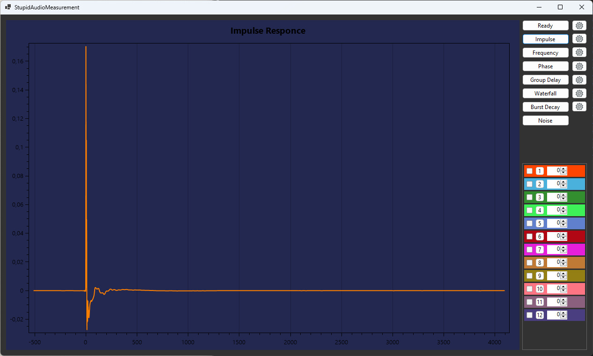
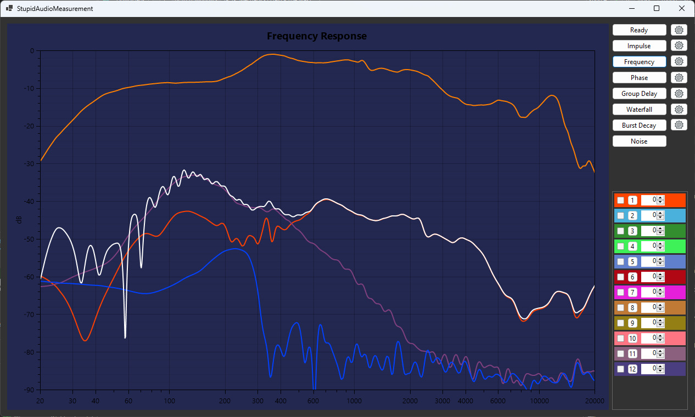
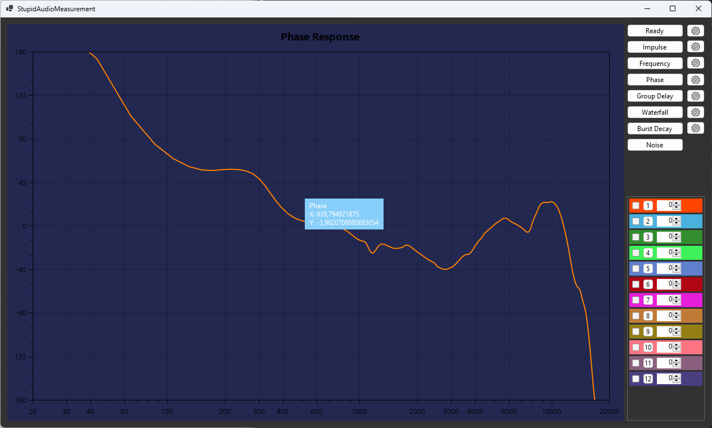
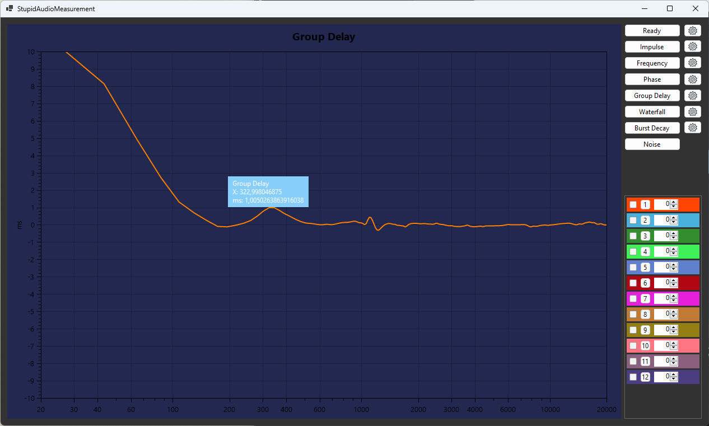
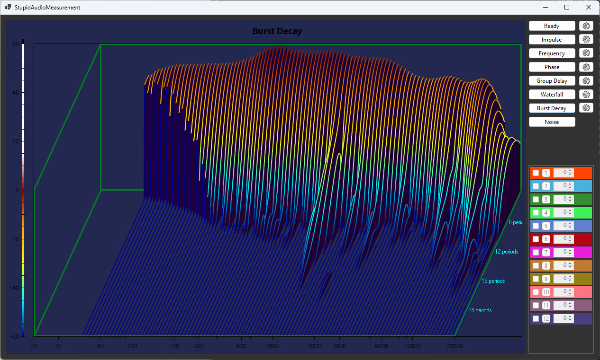
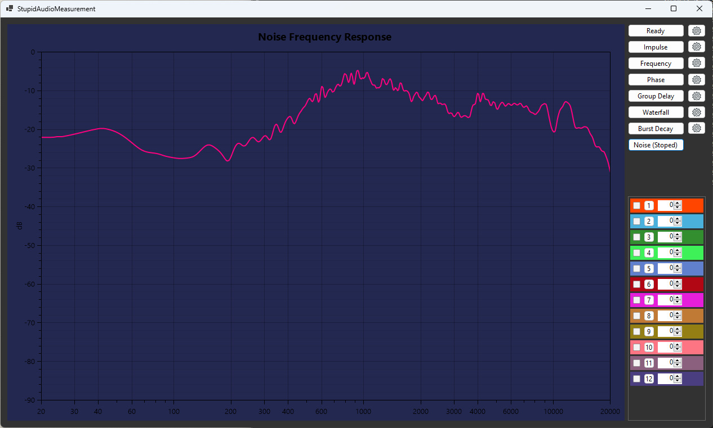

# SAM - Stupid Audio Measurement
Software for measuring the properties of audio paths
 
Possibilities:
* impulse response   
* frequency response   
* phase response   
* group delay   
* waterfall   
* burst decay   
* real-time noise response   